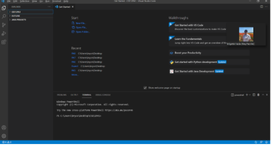
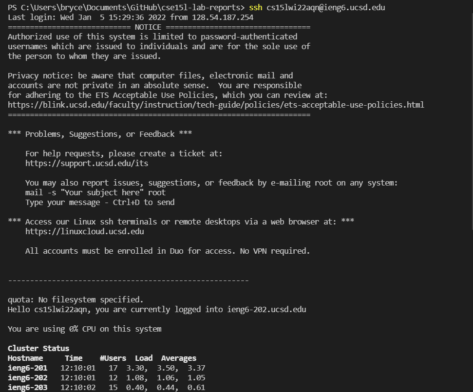
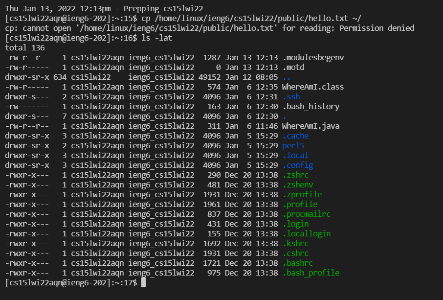
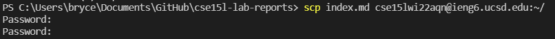
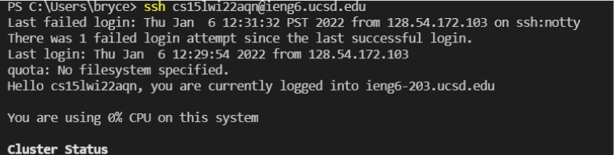
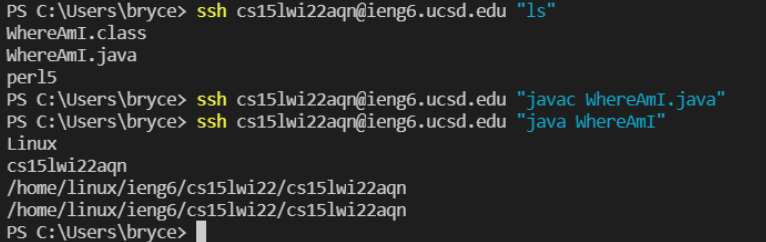

# Lab Report 1: 1/13/2022

## Tutorial For Logging On Course Specific Account

**Installing VSCode**: Go to [code.visualstudio.com](code.visualstudio.com) and download the installer for your specific OS. Then, follow the setup wizard instructions.

**Remotely Connecting**: Open up a new terminal. Then type the command: `ssh cs15lwi22zz@ieng6.ucsd.edu`. For the zz, put your course-specific suffix. This allows you to remotely connect to the ieng6 server housed in the CSE basement.

**Trying Some Commands**: After sshing, try running these commands:
- `cd ~`
- `cd`
- `ls -lat`
- `ls -a`
- `cp /home/linux/ieng6/cs15lwi22/public/hello.txt ~/`

Seen below, the `cp` command copies the content of a source file into a desination file, in this case hello.txt, and the `ls -lat` command lists all the files in the current directory. You might receive an error following the cp command.

**Moving files with `scp`**: Open up a terminal. Then type the following command: `scp (filename here) cs15lwi22zz@ieng6.ucsd.edu:~/`. For the zz, put your course-specific suffix. Make sure you are running this client-side, not server-side. This allows you to copy a file from your client to the server.

**Setting an SSH key**: SSH keys allow you to ssh without inputting a password. Open up a terminal. Then enter the following command: `ssh-keygen`. Hit enter to get default for the password and destination. Then, in powershell as administrator, run the following commands:
- `Get-Service ssh-agent | Set-Service -StartupType Manual`
- `Start-Service ssh-agent`
- `Get-Service ssh-agent`
- `ssh-add ~\.ssh\id_rsa`

After this, you should be able to log on to ssh without a password.

**Optimizing Remote Running**: You can chain commands in ssh together by adding them with quotes or separating them with semicolons.

For example, typing out `ssh cs15lwi22zz@ieng6.ucsd.edu "javac Config.java; java Config"` saves 27 keystrokes (`ssh cs15lwi22zz@ieng6.ucsd.edu` is 30 keystrokes saved, one less enter is 1 keystroke saved, the `""` is 2 keystrokes gained, the `;` is 1 keystroke gained, and the space between the two commands is 1 keystroke gained) from typing out both `ssh cs15lwi22zz@ieng6.ucsd.edu javac Config.java` and `ssh cs15lwi2zz@ieng6.ucsd.edu java Config`, which has the same function. 

