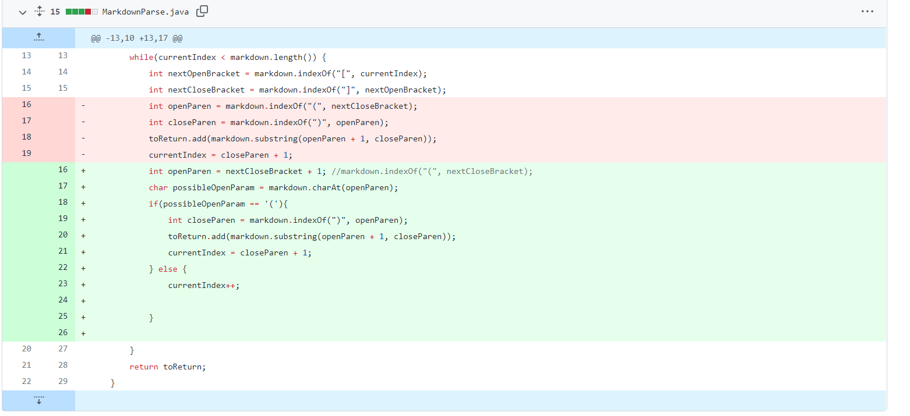
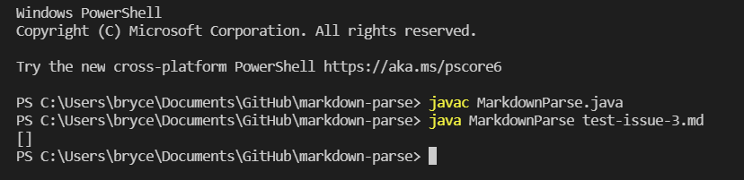
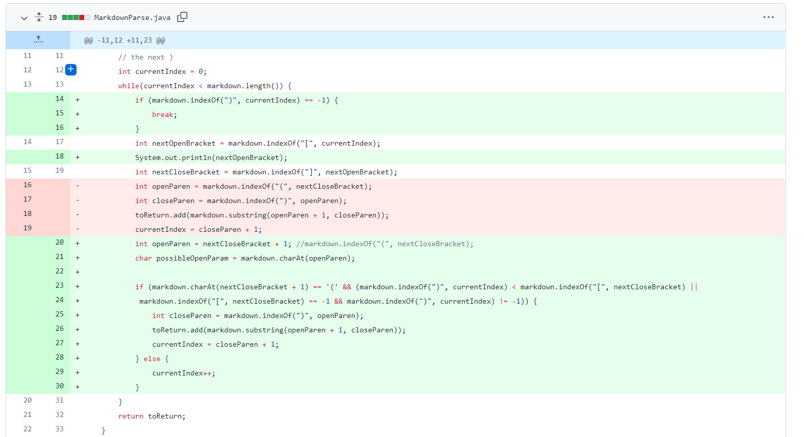
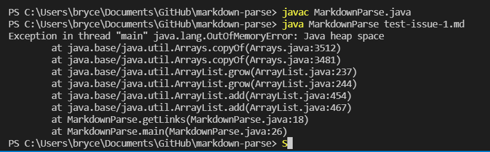
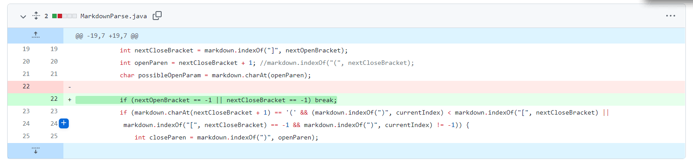
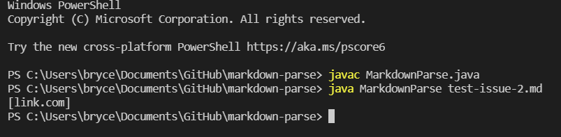

# Lab Report 2: 1/27/2022

## Code Changes:

**Code Change 1**: 

Failure-inducing test: [test-issue-3.md](https://brycepollack.github.io/cse15l-lab-reports/test-issue-3.md)

The bug here is that the while loop breaks when it encounters an unconventional link. The symptom is that the program returns an incorrect answer: it returns an empty list instead of ignoring the text between the brackets and parentheses and returning a list of the links in parentheses. The failure-inducing input is a link with text between the brackets and parentheses followed by a conventional link, and is fixed by checking if the character after the brackets is a parenthesis.

**Code Change 2**: 

Failure-inducing test: [test-issue-1.md](https://brycepollack.github.io/cse15l-lab-reports/test-issue-1.md)

The bug here is an infinite loop caused by a parentheses inside of parentheses. The symptom is an OutOfMemoryError caused by the infinite loop. The failure-inducing input is a link with parentheses inside of the parentheses containing the link, and is fixed by checking if there is an open parenthesis after the open parenthesis marking the start of the link.

**Code Change 3**: 

Failure-inducing test: [test-issue-2.md](https://brycepollack.github.io/cse15l-lab-reports/test-issue-2.md)

The bug here is that the program recognizes any string inside of parentheses as a link. The symptom is that the program returns an incorrect answer: it returns a list containing what's inside the parentheses instead of an empty list. The failure-inducing input is a string inside of parentheses without any brackets in front of it to denote that it's a link.