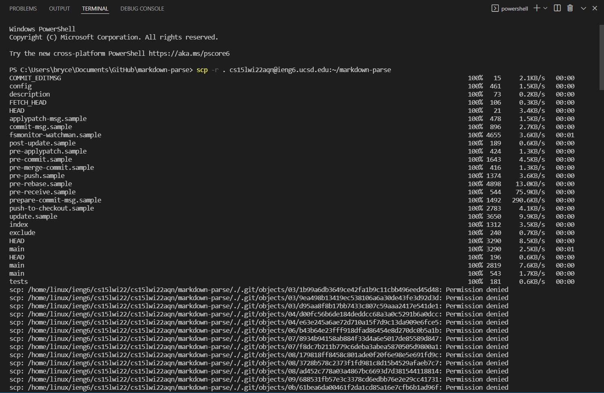
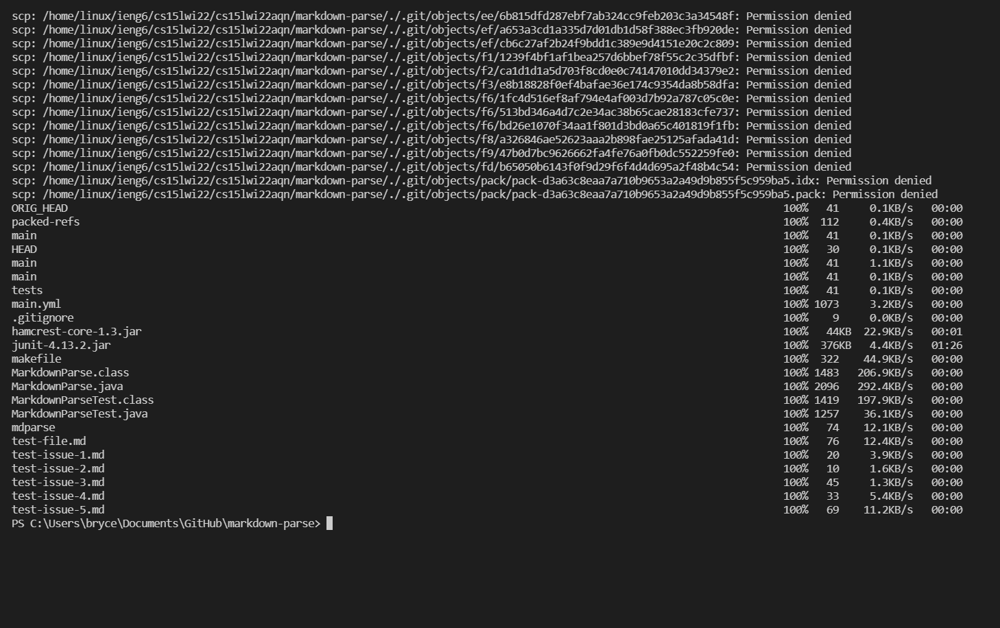
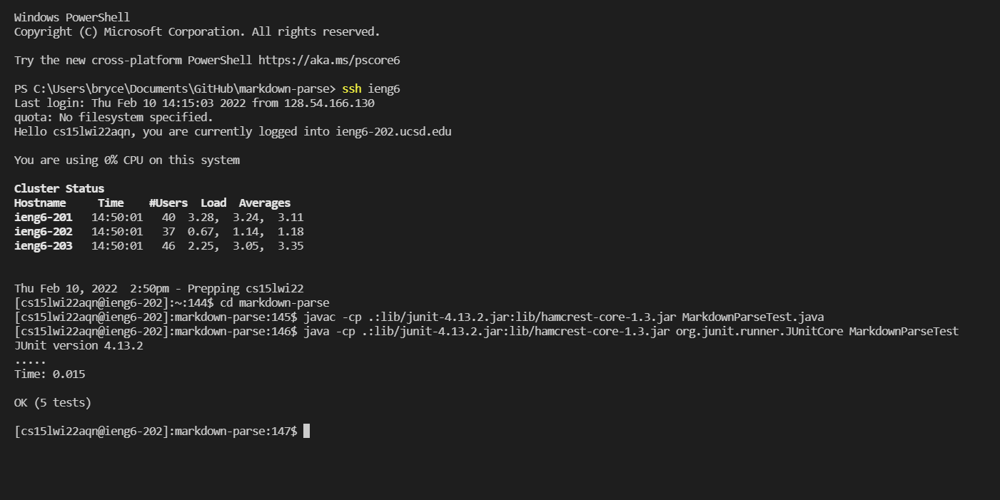
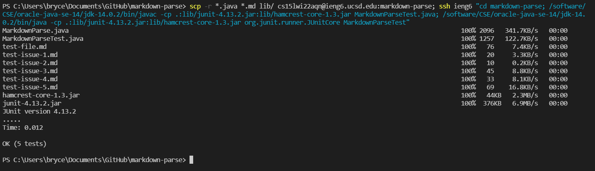

# Lab Report 3: 2/10/2022

## Copy whole directories with `scp -r`:

**1. Copying markdown-parse directory to ieng6 account**:

The command `scp -r . cs15lwi22@ieng6.ucsd.edu:~/markdown-parse` allows a whole directory, in this case markdown-parse, to be copied onto the ieng6 servers. Another command to do the same function will be shown in Step 3.

**2. Logging into ieng6 account after doing this, compiling, and running the tests in this repository**:

As evidenced by the "OK (5 tests)" output, the JUnit tests in this repository were successfully compiled and ran.

**3. Copying the whole directory and running the tests in one line.**:

The whole one-line command is as follows: `scp -r *.java *.md lib/ cs15lwi22aqn@ieng6.ucsd.edu:markdown-parse; ssh ieng6 "cd markdown-parse; /software/CSE/oracle-java-se-14/jdk-14.0.2/bin/javac -cp .:lib/junit-4.13.2.jar:lib/hamcrest-core-1.3.jar MarkdownParseTest.java; /software/CSE/oracle-java-se-14/jdk-14.0.2/bin/java -cp .:lib/junit-4.13.2.jar:lib/hamcrest-core-1.3.jar org.junit.runner.JUnitCore MarkdownParseTest"`

The first part is an alternate way to copy the repository over the ieng6 with scp. The second part is, using a private key, sshing into the ieng6 server. Then, as per Piazza, alternate `javac` and `java` commands are used: `/software/CSE/oracle-java-se-14/jdk-14.0.2/bin/javac` and `/software/CSE/oracle-java-se-14/jdk-14.0.2/bin/java`. This is because the regular commands won't run in the version of Java used by the ieng6 servers.