# Lab Report 4: 2/24/2022

## MarkdownParse repositories:

- [My Implementation](https://github.com/brycepollack/markdown-parse)
- [Reviewed Implementation](https://github.com/YueSteveYin/MarkDownParseGroup)

## Snippet 1:

- **Expected:**

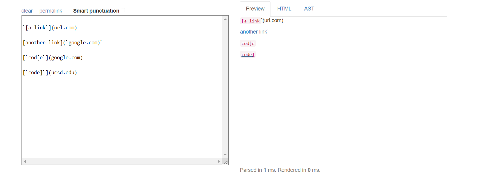

- **Test:**

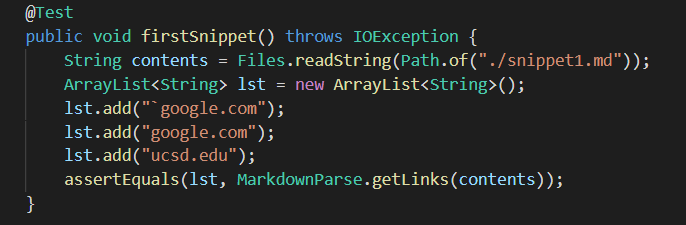

- **My Output:**

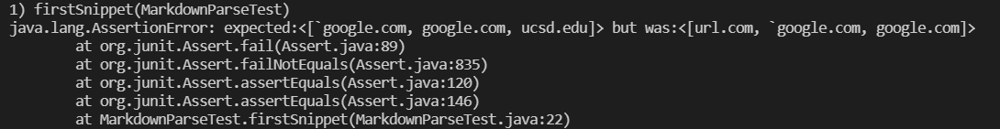

- **Their Output:**

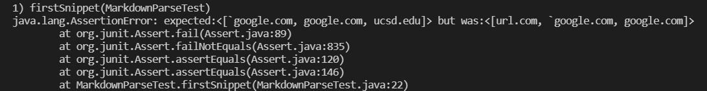

## Snippet 2:

- **Expected:**

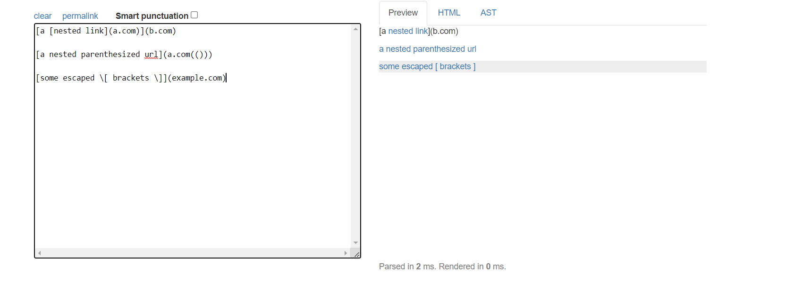

- **Test:**

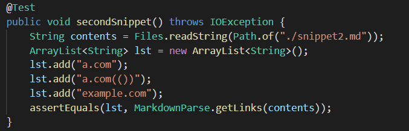

- **My Output:**

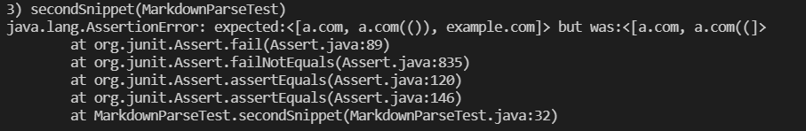

- **Their Output:**

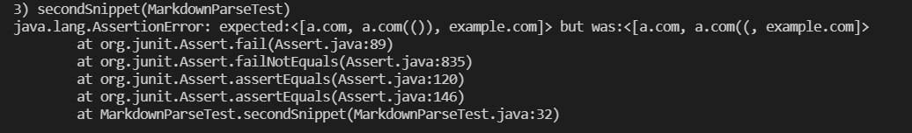

## Snippet 3:

- **Expected:**

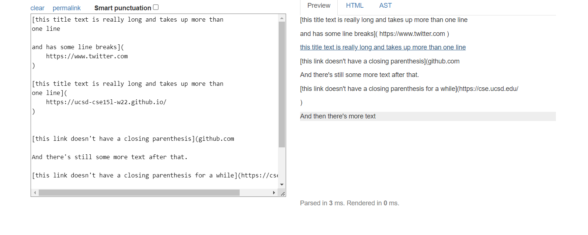

- **Test:**

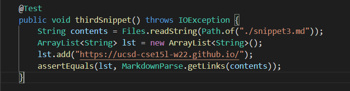

- **My Output:**

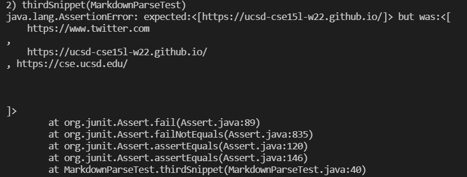

- **Their Output:**

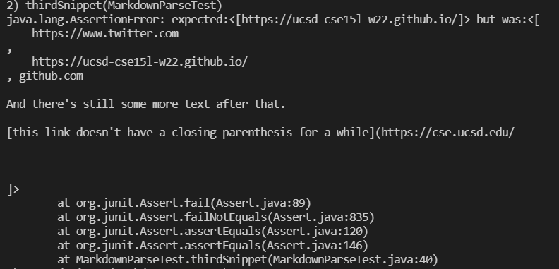

## Questions:

- **Changes for Snippet 1:**

Removing the text before the first bracket and the text after the last parenthesis via String formatting could help solve the backtick issue. The code change could be adding a line like `String line = markdown.substring(openBracket, closeParen);` and only operating on that line. This, however, would be a very involved code change since it involves changing the rest of the code to operate aroud `line`.

- **Changes for Snippet 2:** 

I think that solving the nested bracket and parenthesis issue would be very involved. Our getLinks method revolves around finding the indices of these brackets and parentheses, and having nested versions of these always throws the indices that we use to track the link string off. 

- **Changes for Snippet 3:** 

Removing all new lines from the markdown file being ran on could solve the new line issue. This could be done with `markdown = markdown.replaceAll("\n", "")` and could potentially be a very minimal fix. 