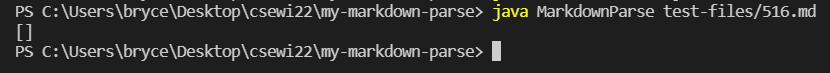
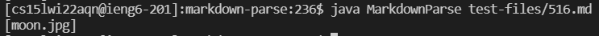
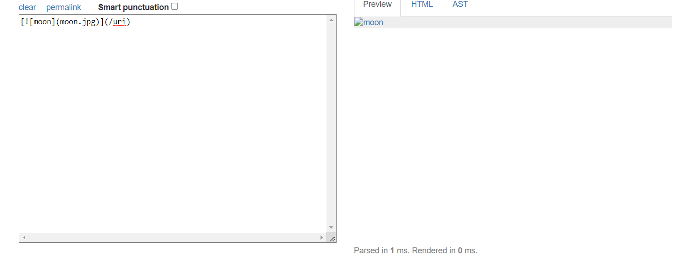
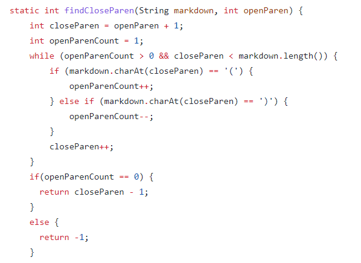
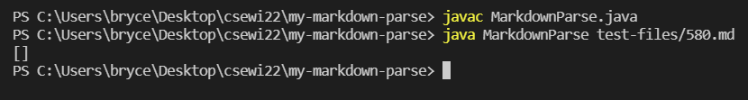
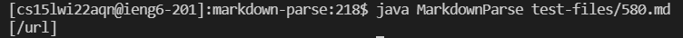
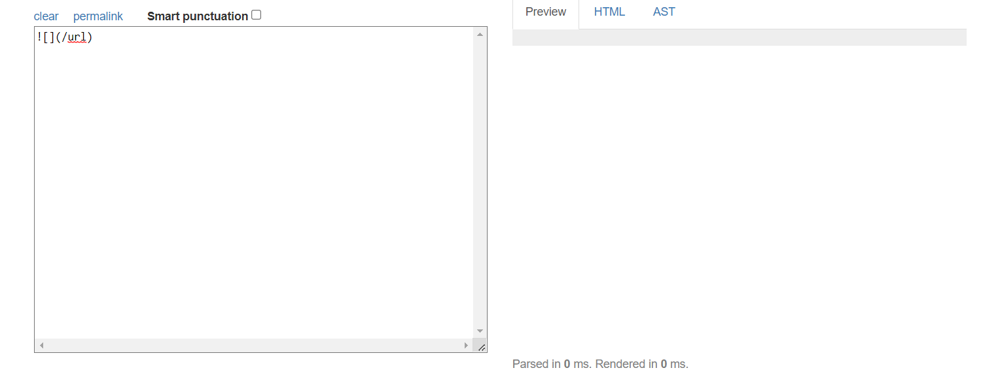
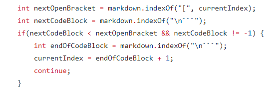

# Lab Report 5: 3/10/2022

## How I Found Issues With My Code vs. Issues With Given Code:

I found the tests with different results by running MarkdownParse using my implementation client-side and the professor's implementation server-side on the ieng6 server. I thought this was the best way to find differences between the two implementations because most of the commonmark tests weren't applicable: both implementations would fail all of the non-link and non-image tests. 

## Test 1: 516.md

My Output for 516.md:

Professor's Output for 516.md:

Expected Output for 516.md:

This shows that neither implementation is correct for this particular test. The expected output should be `/uri`, as evidenced by that being the url linked to the image. 

For the professor's implementation, the problem lies with this piece of code, where the closing parenthesis is defined as the first closing parenthesis found. A potential fix could be changing that definition to be the last closing parenthesis.

# Test 2: 580.md

My Output for 580.md:

Professor's Output for 580.md:

Expected Output for 580.md:

This shows that the professor's implementation is correct for this particular test. The expected output should be blank. 

For the professor's implementation, the problem lies with this piece of code, where all code blocks are treated equally as being between an open bracket and the next new line. Instead, code blocks should be treated on a case by case basis or vetted for being an image: if it is an image, then if the brackets after the `!` contain no characters, then there should be no string added to the returned list.